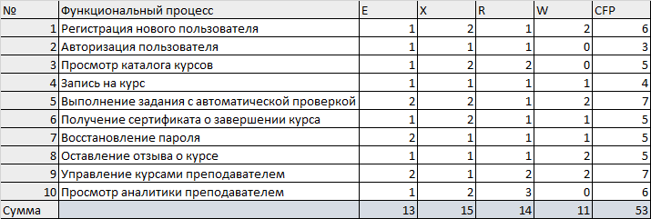
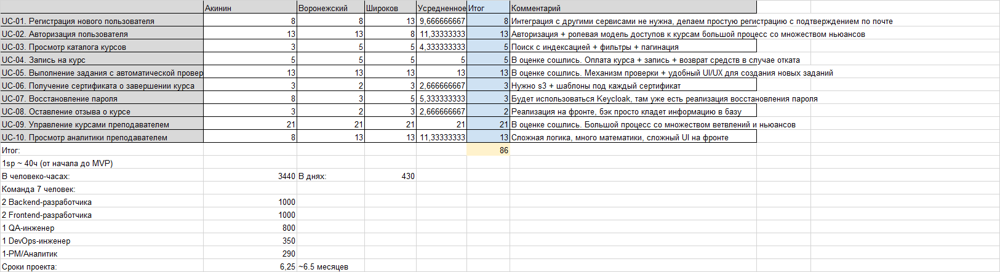

# Оценка проекта
По итогам [Первой фазы](Phase1.md) в качестве проекта было выбрано приложение: ***Онлайн-курсы***

Концептуальное описание: Платформа для онлайн-курсов с автоматической проверкой заданий

## Use Cases

Use cases представлены **[здесь](use_cases.md)**.

## COSMIC Function Points

Прикинуты трудозатраты **[здесь (CFP.xlsx)](CFP.xlsx)** 

## Use Case Points

Прикинуты трудозатраты **[здесь (UCP.xlsx)](Use%20Case%20Points.xlsx)**

## Оценки трудозатрат

Использована стандартная шкала Fibonacci SP:
1, 2, 3, 5, 8, 13, 21 …

Прикинуты трудозатраты **[здесь (Фаза 3 - оценка трудозатрат.xlsx)](Фаза%203%20-%20оценка%20трудозатрат.xlsx)**

## Очередность разработки и внедрения функционала

### 1 Этап 
- UC-01 Регистрация
- UC-02 Авторизация
- UC-04 Запись на курс
- UC-09 Управление курсами

### 2 Этап
- UC-06 Сертификаты
- UC-07 Восстановление пароля
- UC-03 Каталог курсов

### 3 Этап
- UC-05 Автоматическая проверка заданий
- UC-10 Просмотр аналитики
- UC-08 Отзывы

### Сроки: 
- Этап 1: 13 - 14 недель
- Этап 2: 3 - 4 недель
- Этап 3: 8 - 9 недель

